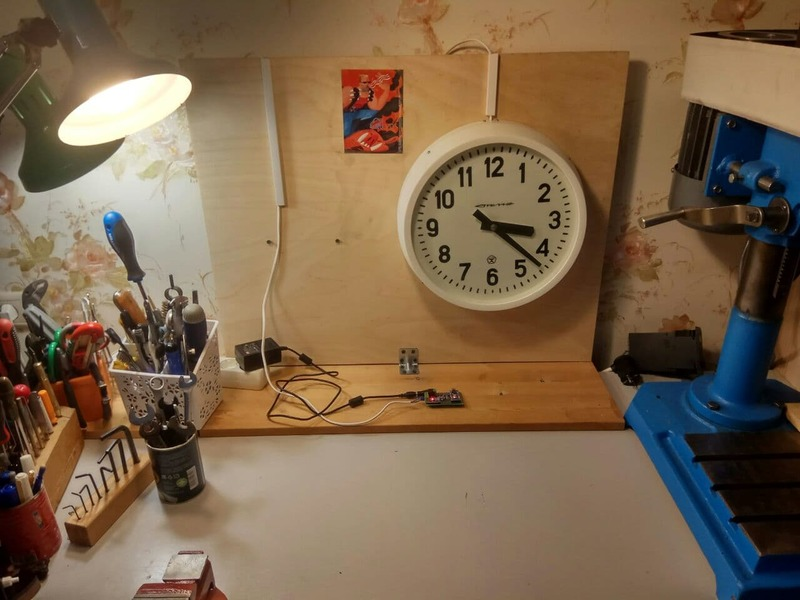
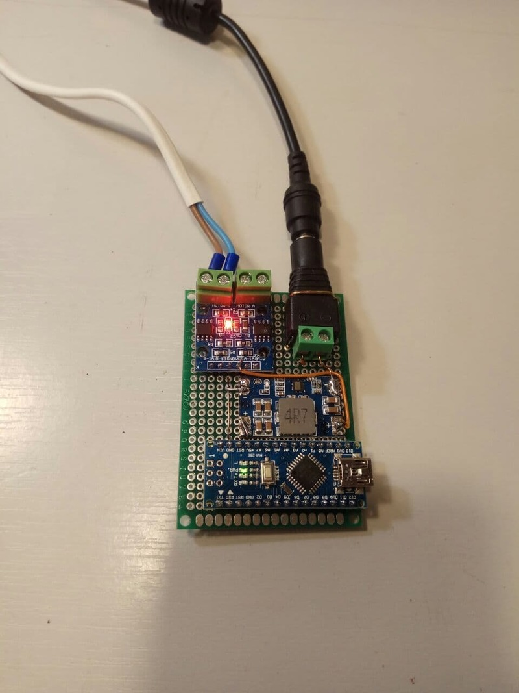

# Контроллер управления вторичными часами, типа "Стрела"

Код достаточно простой, думаю в пояснении не нуждается. Возможно я когда-нибудь нарисую схему.

Для управления используется любая плата Arduino. Управление может быть реализовано на реле или, как в моём случае на драйвере двигателя. 

Сигнальные выходы: 2 и 3 порт, остальное понятно из кода.

Подробнее о принципе работы можно [прочитать в этой статье](https://habr.com/ru/company/ruvds/blog/572312/). 
